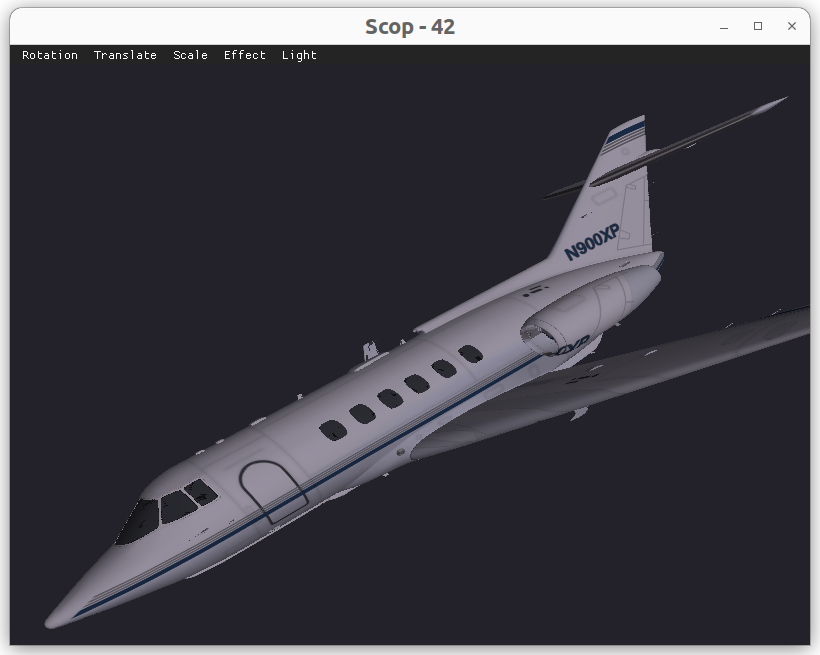


# Projet OpenGL : Affichage d'un objet 3D interactif

*Relecture du code après un an, le code est horriblement structuré, ça fait peur...  mdrr*

## Description

Ce projet est une initiation à OpenGL, l'objectif du projet est de charger puis afficher un objet 3D. L'application permettra de faire tourner l'objet autour de son centre. En plus de cela, une bibliothèque mathématique, un chargeur de fichiers bitmap (textures), et un chargeur de fichiers OBJ seront implémentés. L'interface utilisateur prend en charge diverses commandes, dont certaines sont accessibles via un menu ImGui intégré.

## Fonctionnalités

-   Chargement et affichage d'un objet 3D en utilisant OpenGL.
-   Rotation de l'objet autour de son centre.
-   Bibliothèque mathématique personnalisée pour les transformations et les calculs nécessaires.
-   Chargeur de fichiers bitmap pour les textures.
-   Chargeur de fichiers OBJ pour importer des modèles 3D.
-   Contrôles clavier :
    -   Z : Reculer
    -   S : Avancer
    -   Q : Déplacer vers la gauche
    -   D : Déplacer vers la droite
    -   A : Monter
    -   E : Descendre
    -   FLECHES : Rotations
    -   ESPACE : Afficher les triangles
-   Menu ImGui intégré avec des commandes supplémentaires.

## Bonus

-   Affichage correct des textures en fonction de leurs coordonnées de texture.
-   Gestion basique de l'éclairage pour une expérience visuelle améliorée.
-   Quelques autres petites fonctionnalités supplémentaires.

## Comment exécuter le projet

1.  **Prérequis :**
    
    -   Compiler et installer les dépendances nécessaires pour OpenGL.
    -   Assurez-vous d'avoir ImGui intégré dans votre projet.
2.  **Compilation :**
    
    -   Compilez le projet en utilisant le Makefile si vous êtes sur Linux.
 *(Si vous utilisez un système d'exploitation autre que Linux, veuillez ajuster le fichier Makefile en consultant les ressources disponibles sur Google afin de permettre une compilation correcte.)*
3.  **Exécution :**
    
    -   Exécutez l'application compilée avec la commande suivante :
       
        `./scop "chemin/vers/le/model3D.obj" "chemin/vers/la/texture.bmp"` 
        
    -   Utilisez les touches spécifiées pour interagir avec l'objet 3D.
    -   Explorez les fonctionnalités supplémentaires disponibles dans le menu ImGui.

## Remarques

Assurez-vous d'avoir correctement configuré votre environnement de développement pour OpenGL, ImGui, et toutes les autres dépendances nécessaires avant de compiler et exécuter le projet.
